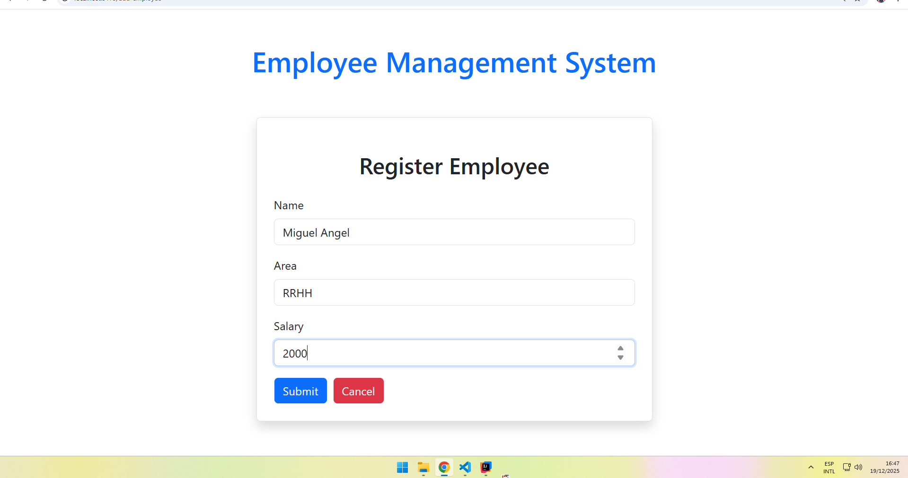
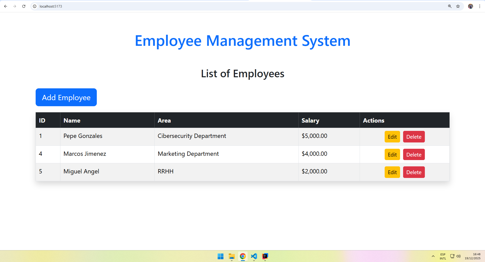
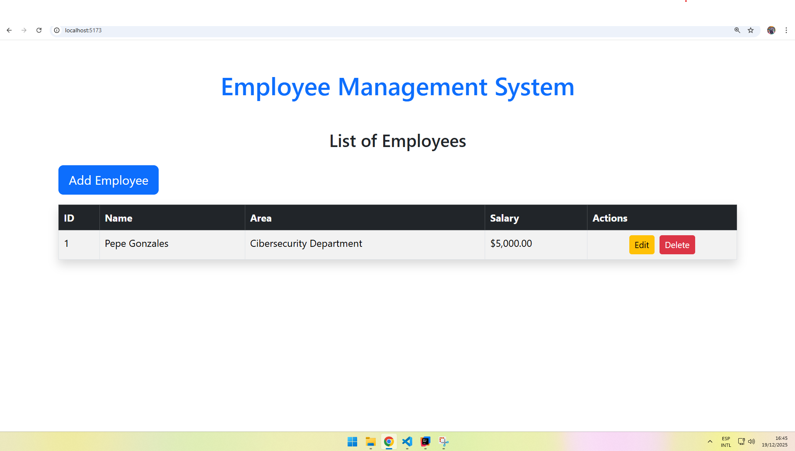
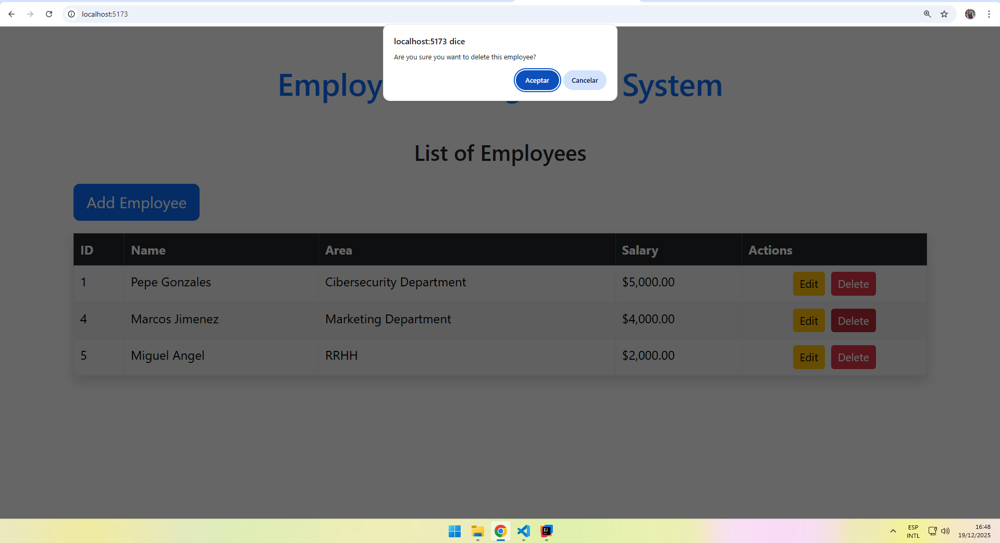
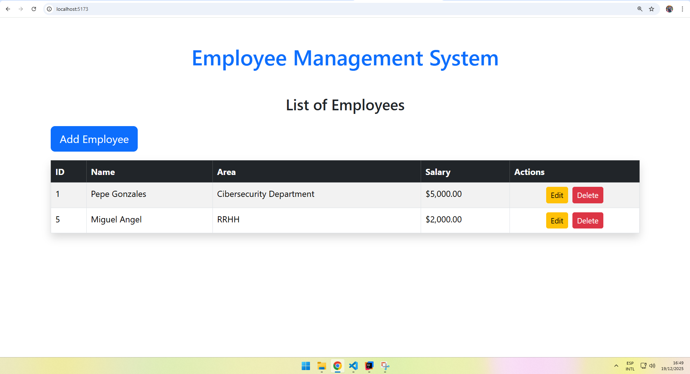

# 👔 Employee Management System - Fullstack

> A complete Employee Management System (CRUD) built with a modern microservices-ready architecture and reactive frontend.


## 📖 About the Project

This project is a **Fullstack Application** designed to manage an organization's employee payroll. It allows performing Create, Read, Update, and Delete (CRUD) operations on employee records, handling sensitive data such as salaries and department areas.

The main goal was to implement **software development best practices**, enforcing a strict separation of concerns through a layered architecture and ensuring data integrity using Static Typing (Java/TypeScript).

---

## 🏗️ Architecture & Design Patterns

The system follows a decoupled **RESTful** architecture:

1.  **Backend (API REST):** Built with Spring Boot. Acts as the source of truth and handles business logic.
2.  **Frontend (SPA):** Built with React and Vite. Consumes the API via asynchronous calls.
3.  **Database:** Relational data persistence with MySQL.

### Key Patterns Implemented:
* **DTO Pattern (Data Transfer Object):** Usage of `EmployeeRequest` and `EmployeeResponse` to decouple the Database Entity from the Presentation Layer, enhancing API security and flexibility.
* **Layered Architecture:** Strict separation of concerns:
    * `Controller`: Handles HTTP requests.
    * `Service`: Business logic.
    * `Repository`: Data access (JPA).
* **Dependency Injection:** Inversion of Control managed by Spring (`@RequiredArgsConstructor`) for clean and testable code.
* **Mapper Pattern:** Object transformation between Entity <-> DTO.
* **Service Layer Pattern (Frontend):** Axios logic is separated from UI components.

---

## 🛠️ Tech Stack

### ☕ Backend (Java ecosystem)
* **Java 17 (JDK):** Core language.
* **Spring Boot 3:** Main framework.
* **Spring Data JPA:** Abstraction for database handling.
* **Hibernate:** ORM for object-relational mapping.
* **Lombok:** Boilerplate code reduction.
* **Maven:** Dependency management.

### ⚛️ Frontend (React ecosystem)
* **React 18:** Component-based UI library.
* **TypeScript:** JS superset for static typing and robustness.
* **Vite:** High-performance build tool (Next-gen).
* **Axios:** Promise-based HTTP client.
* **Bootstrap 5:** CSS framework for responsive design.
* **React Router DOM:** SPA navigation handling.

### 🗄️ Database
* **MySQL:** Relational database engine.

---

## 🚀 Installation & Setup

Follow these steps to run the project locally.

### Prerequisites
* Java 17+ installed.
* Node.js and NPM installed.
* MySQL Server running.

### 1. Backend Setup
1.  Navigate to the server folder:
    ```bash
    cd employees
    ```
2.  Configure your database in `src/main/resources/application.properties`:
    ```properties
    spring.datasource.url=jdbc:mysql://localhost:3306/employees_db
    spring.datasource.username=YOUR_DB_USERNAME
    spring.datasource.password=YOUR_DB_PASSWORD
    ```
3.  Run the application (Spring Boot will auto-create the DB):
    ```bash
    ./mvnw spring-boot:run
    ```

### 2. Frontend Setup
1.  Open a new terminal and navigate to the client folder:
    ```bash
    cd employees-frontend
    ```
2.  Install dependencies:
    ```bash
    npm install
    ```
3.  Start the development server:
    ```bash
    npm run dev
    ```
4.  Open your browser at `http://localhost:5173`.

---
## 📸 Project Screenshots

Here is a visual tour of the application functionalities:

### 📋 Main Dashboard & Listing
The main view displays all employees with formatted salaries and action buttons.


### ➕ Employee Registration
Form with validation to add new records to the database.


### ✏️ Edit & Update
You can modify existing employee details easily.
| Before Update | After Update |
|:---:|:---:|
|  |  |

### 🗑️ Delete Flow
Secure deletion with a confirmation modal to prevent accidents.
| Confirmation Modal | Result |
|:---:|:---:|
|  |  |


## ✒️ Author

**Joaquin Tumba**

* **Role:** Fullstack Developer
* **Email:** [joaquintumba010@gmail.com](mailto:joaquintumba010@gmail.com)
* **LinkedIn:** [linkedin.com/in/joaquintumba](https://www.linkedin.com/in/joaquintumba/)
* **GitHub:** [github.com/adritmurillo](https://github.com/adritmurillo)

---
